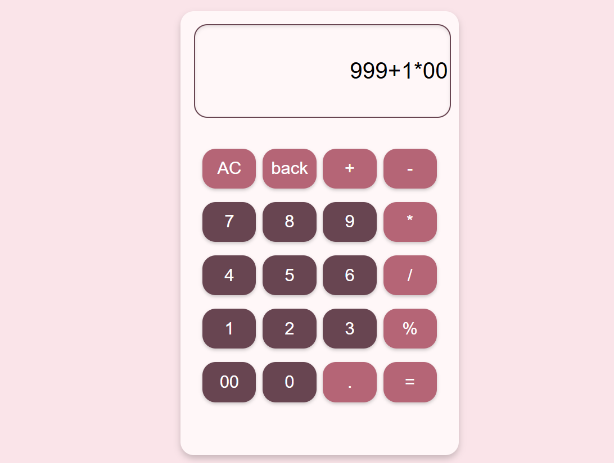

# Calculator Project

Welcome to ComputeEase. This is a simple and interactive calculator web application built using **HTML**, **CSS**, and **JavaScript**. It allows users to perform basic arithmetic operations such as addition, subtraction, multiplication, and division. The project is designed to provide a seamless user experience with a clean and intuitive interface.

## Purpose

The purpose of this project is to create an easy-to-use web-based calculator that allows users to perform basic calculations directly in their browsers. This project serves as a hands-on learning exercise in integrating HTML, CSS, and JavaScript to build a fully functional application. It also aims to enhance web development skills by focusing on front-end design and interactivity.

## Features

- **Basic Arithmetic Operations**: Perform addition, subtraction, multiplication, and division.
- **User-Friendly Interface**: Easy-to-navigate calculator with buttons for numbers and operations.
- **Real-Time Input and Output**: The input expression is dynamically updated as the user presses buttons, and the result is calculated instantly.
- **All Clear (AC) Button**: Option to clear the current input expression.

---

## Screenshots

### 1. Calculator Interface

### 2. Expression String

### 3. Calculation Result

## How to Run

1. Clone this repository to your local machine:
   git clone https://github.com/ShraddhaThakare801/calculator-project.git
  
2. Open the project folder and double-click on `index.html` to open the calculator in your browser.

## Technologies Used

- **HTML**: For structuring the user interface.
- **CSS**: For styling the calculator's layout and buttons.
- **JavaScript**: For handling the calculation logic and interactive input.

---

## Contributing

Feel free to fork this repository and make your contributions. If you would like to collaborate, open a pull request and I’ll be happy to review it.

## License

This project is open-source and available under the [MIT License](LICENSE).

         
